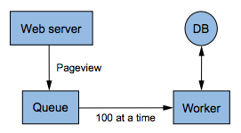
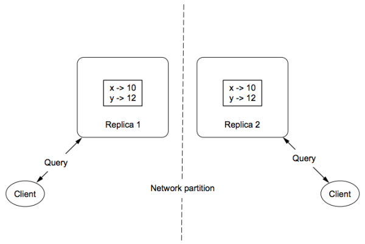
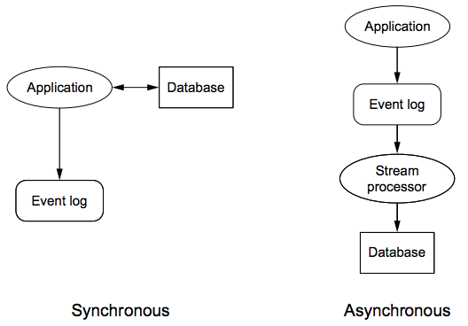
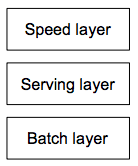
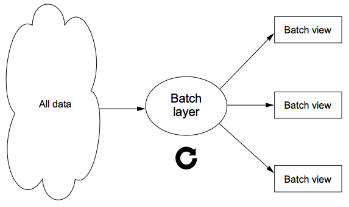
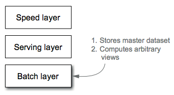
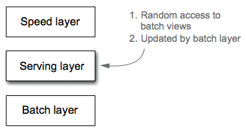
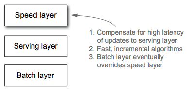
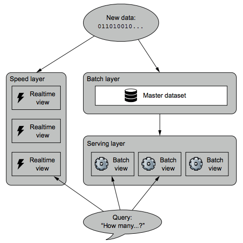

### **Chapter 1. A new paradigm for Big Data**

[p1-2]

Traditional systems, and the data management techniques associated with them, have failed to scale to Big Data.

To tackle the challenges of Big Data, a lot of new technologies have emerged, many of which have been grouped under the term *NoSQL*. In some ways, these new technologies are more complex than traditional databases, and in other ways they're simpler. These systems can scale to vastly larger sets of data, but using these technologies effectively requires a fundamentally new set of techniques. They aren't one-size-fits-all solutions.

Many of these Big Data systems were pioneered by Google, including:

* Distributed filesystems,
* The  MapReduce computation framework,
* Distributed locking services.

Another notable pioneer in the space was Amazon, which created an innovative distributed key/value store called Dynamo. The open source community responded in the years following with Hadoop, HBase, MongoDB, Cassandra, RabbitMQ, and countless other projects.

This book is about complexity as much as it is about scalability. Some of the most basic ways people manage data in traditional systems like relational database management systems (RDBMSs) are too complex for Big Data systems.The simpler, alternative approach is the new paradigm for Big Data. This approach is dubbed the [**Lambda Architecture**](https://en.wikipedia.org/wiki/Lambda_architecture).

### How this book is structured

This book is a theory book, focusing on how to approach building a solution to any Big Data problem. It is structured into theory and illustration chapters.

### Scaling with a traditional database

The example in this section is a simple web analytics application, which tracks the number of pageviews for any URL a customer wishes to track. The customer's web page pings the application's web server with its URL every time a pageview is received. Additionally, the application should be able to tell you at any point what the top 100 URLs are by number of pageviews.

You start with a traditional relational schema for the pageviews similiar to the table below:

Column name | Type
----------- | ----
`id` | `integer`
`user_id` | `integer`
`url` | `varchar(255)`
`pageviews` | `bigint`

Your back end consists of an RDBMS with a table of that schema and a web server. Whenever someone loads a web page being tracked by your application, the web page pings your web server with the pageview, and your web server increments the corresponding row in the database.

The following subsections discuss what problems emerge as you evolve the application: you'll run into problems with both scalability and complexity.

#### Scaling with a queue

As the traffic to your application is growing, you got a lot of "Timeout error on inserting to the database" error, since the database can't keep up with the load, so write requests to increment pageviews are timing out.

Instead of having the web server hit the database directly, you insert a queue between the web server and the database. Whenever you receive a new pageview, that event is added to the queue. You then create a worker process that reads 100 events at a time off the queue, and batches them into a single database update. This is illustrated in the figure below:

[](figure_1.2.png "Figure 1.2 Batching updates with queue and worker")

This scheme resolves the timeout issues you were getting. If the database ever gets overloaded again, the queue will just get bigger instead of timing out to the web server and potentially losing data.

#### Scaling by sharding the database

As your application continues to get more and more popular, and again the database gets overloaded. Your worker can't keep up with the writes; adding more workers to parallelize the updates doesn't help; the database is clearly the bottleneck.

The approach is to use multiple database servers and spread the table across all the servers. Each server will have a subset of the data for the table. This is known as [**horizontal partitioning**](https://en.wikipedia.org/wiki/Partition_(database)) or [**sharding**](https://en.wikipedia.org/wiki/Shard_(database_architecture)). This technique spreads the write load across multiple machines.

The sharding technique you use is to choose the shard for each key by taking the hash of the key modded by the number of shards. Mapping keys to shards using a hash function causes the keys to be uniformly distributed across the shards. You do the following:

1. Write a script to map over all the rows in your single database instance, and split the data into four shards. Since it takes a while to run this script, you turn off the worker that increments pageviews to avoid losing increments during the transition.
2. Wrap a library around database-handling code that reads the number of shards from a configuration file, and redeploy all of your application code, since all application code needs to know how to find the shard for each key. You have to modify your top-100-URLs query to get the top 100 URLs from each shard and merge those together for the global top 100 URLs.

As the application gets more popular, you keep having to reshard the database into more shards to keep up with the write load:

* Each time gets more and more painful because there's so much more work to coordinate. You can't just run one script to do the resharding, as that would be too slow. You have to do all the resharding in parallel and manage many active worker scripts at once.
* If you forget to update the application code with the new number of shards, it causes many of the increments to be written to the wrong shards. So you have to write a one-off script to manually go through the data and move whatever was misplaced.

#### Fault-tolerance issues begin

With so many shards, it becomes a frequent occurrence for the disk on one of the database machines to go bad. That portion of the data is unavailable while that machine is down. You do a couple of things to address this:

* You update your queue/worker system to put increments for unavailable shards on a separate “pending” queue that you attempt to flush once every five minutes.
* You use the database's replication capabilities to add a slave to each shard so you have a backup in case the master goes down. You don't write to the slave, but at least customers can still view the stats in the application.

#### Corruption issues

You accidentally deploy a bug to production that increments the number of pageviews by two, instead of by one, for every URL and you don't notice until 24 hours later, but by then the damage is done. Your weekly backups don't help because there's no way of knowing which data got corrupted.  After all this work trying to make your system scalable and tolerant of machine failures, your system has no resilience to a human making a mistake.

#### What went wrong?

As the application evolved, the system continued to get more and more complex: queues, shards, replicas, resharding scripts, etc. Developing applications on the data requires a lot more than just knowing the database schema; your code needs to know how to talk to the right shards, and if you make a mistake, there's nothing preventing you from reading from or writing to the wrong shard.

 One problem is that your database is not self-aware of its distributed nature, so it can't help you deal with shards, replication, and distributed queries. All that complexity got pushed to you both in operating the database and developing the application code.

However, the worst problem is that the system is not engineered for human mistakes.  As the system keeps getting more complex, it is more likely that a mistake will be made:

* Mistakes in software are inevitable. If you're not engineering for it, you might as well be writing scripts that randomly corrupt data.
* Backups are not enough; the system must be carefully thought out to limit the damage a human mistake can cause.
* Human-fault tolerance is not optional. It's essential, especially when Big Data adds so many more complexities to building applications.

### How will Big Data techniques help?

The Big Data techniques to be discussed address these scalability and complexity issues in dramatically:

1. The databases and computation systems for Big Data are aware of their distributed nature. Sharding and replication are handled for you.
    * Shading: the logic is internalized in the database, preventing situations where you accidentally query the wrong shard.
    * Scaling: just add new nodes and the systems will automatically rebalance onto the new nodes.
2. Make data immutable. Instead of storing the pageview counts as your core dataset, which you continuously mutate as new pageviews come in, you store the raw pageview information, which is never modified. <u>When you make a mistake, you might write bad data, but at least you won't destroy good data.</u> This is a much stronger human-fault tolerance guarantee than in a traditional system based on mutation. [p6]

### NoSQL is not a panacea

Innovation in scalable data systems in the past decades include:

* Large-scale computation systems: such as [Hadoop](https://en.wikipedia.org/wiki/Apache_Hadoop)
* Databases: such as [Cassandra](https://en.wikipedia.org/wiki/Apache_Cassandra) and [Riak](https://en.wikipedia.org/wiki/Riak).

These systems can handle very large amounts of data, but with serious trade-offs:

* Hadoop can parallelize large-scale batch computations on very large amounts of data, but the computations have high latency. You don't use Hadoop for anything where you need low-latency results.
* NoSQL databases like Cassandra achieve their scalability by offering you a much more limited data model than you're used to with something like SQL.
    * Squeezing your application into these limited data models can be very complex.
    * They are not human-fault tolerant, because the databases are mutable.

These tools on their own are not a panacea. But when intelligently used in conjunction with one another, you can produce scalable systems for arbitrary data problems with human-fault tolerance and a minimum of complexity. This is the Lambda Architecture discussed throughout the book.

### First principles

What does a data system do? An intuitive definition is:

> A data system answers questions based on information that was acquired in the past up to the present.

* Data systems don't just memorize and regurgitate information. They combine bits and pieces together to produce their answers.
* All bits of information are equal. Some information is derived from other pieces of information.
* When you keep tracing back where information is derived from, you eventually end up at information that's not derived from anything. This is the rawest information you have: information you hold to be true simply because it exists. This information is called *data*.

Data is often used interchangeably with the word *information*. But for the remainder of this book, when we use the word data, we're referring to that special information from which everything else is derived.

The most general-purpose data system answers questions by looking at the entire dataset, which has the definition:

> query = function(all data)

[p7]

The Lambda Architecture provides a general-purpose approach to implementing an arbitrary function on an arbitrary dataset and having the function return its results with low latency. This does not mean always using the same technologies to implement a database system; the Lambda Architecture defines a consistent approach to choosing those technologies and to wiring them together to meet your requirements.

### Desired properties of a Big Data system

Not only must a Big Data system perform well and be resource-efficient, it must be easy to reason about as well.

#### Robustness and fault tolerance

Systems need to behave correctly despite any of the following situations:

* Machines going down randomly
* The complex semantics of consistency in distributed databases
* Duplicated data
* Concurrency

These challenges make it difficult even to reason about a system is doing. Part of making a Big Data system robust is avoiding these complexities so that you can easily reason about the system

It's imperative for systems to be *human-fault tolerant*, which is an oft-overlooked property. In a production system, it's inevitable that someone will make a mistake, such as by deploying incorrect code that corrupts values in a database. If you build immutability and recomputation into the core of a Big Data system, the system will be innately resilient to human error by providing a clear and simple mechanism for recovery.

#### Low latency reads and updates

* Most applications require reads to be satisfied with very low latency, typically
between a few milliseconds to a few hundred milliseconds.
* The update latency requirements vary a great deal between applications. Some applications require updates to propagate immediately, but in other applications a latency of a few hours is fine.

You need to be able to:

* Achieve low latency updates when you need them in your Big Data systems,
* Achieve low latency reads and updates without compromising the robustness of the system.

#### Scalability

<u>Scalability is the ability to maintain performance in the face of increasing data or load by adding resources to the system.</u> The Lambda Architecture is horizontally scalable across all layers of the system stack: scaling is accomplished by adding more machines.

#### Generalization

A general system can support a wide range of applications. Because the Lambda Architecture is based on functions of all data, it generalizes to all applications.

#### Extensibility

YExtensible systems allow functionality to be added with a minimal development cost, without having to reinvent the wheel each time you add a related feature or make a change to how your system works.

Oftentimes a new feature or a change to an existing feature requires a migration of old data into a new format. Part of making a system extensible is making it easy to do large-scale migrations. Being able to do big migrations quickly and easily is core to the approach under discussion.

#### Ad hoc queries

Every large dataset has unanticipated value within it. Being able to mine a dataset arbitrarily gives opportunities for business optimization and new applications. Ultimately, you can't discover interesting things to do with your data unless you can ask arbitrary questions of it.

#### Minimal maintenance

Maintenance is the work required to keep a system running smoothly. This includes:

* Anticipating when to add machines to scale,
* Keeping processes up and running,
* Debugging anything that goes wrong in production.

An important part of minimizing maintenance is choosing components that have as little implementation complexity as possible. You want to rely on components that have simple mechanisms underlying them. In particular, distributed databases tend to have very complicated internals. The more complex a system, the more likely something will go wrong, and the more you need to understand about the system to debug and tune it.

<u>You combat implementation complexity by relying on simple algorithms and simple components.</u> A trick employed in the Lambda Architecture is to push complexity out of the core components and into pieces of the system whose outputs are discardable after a few hours. The most complex components used, like read/write distributed databases, are in this layer where outputs are eventually discardable.

#### Debuggability

A Big Data system must provide the information necessary to debug the system when things go wrong. The key is to be able to trace, for each value in the system, exactly what caused it to have that value.

Debuggability is accomplished in the Lambda Architecture through the functional nature of the batch layer and by preferring to use recomputation algorithms when possible.

### The problems with fully incremental architectures

Traditional architectures look like the figure below:

[](figure_1.3.png "Figure 1.3 Fully incremental architecture")

What characterizes these architectures is the use of read/write databases and maintaining the state in those databases incrementally as new data is seen. For example, an incremental approach to counting pageviews would be to process a new pageview by adding one to the counter for its URL. The vast majority of both relational and non-relational database deployments are done as fully incremental architectures. This has been true for many decades.

Fully incremental architectures are so widespread that many people don't realize it's possible to avoid their problems with a different architecture.  This is called *familiar complexity* (complexity that's so ingrained, you don't even think to find a way to avoid it).

The problems with fully incremental architectures are significant. This section discusses:

* General complexities brought on by any fully incremental architecture.
* Two contrasting solutions for the same problem: one using the best possible fully incremental solution, and one using a Lambda Architecture.

You'll see that the fully incremental version is significantly worse in every respect.

#### Operational complexity

With many complexities inherent in fully incremental architectures that create difficulties in operating production infrastructure, this section focuses on one: the need for read/write databases to perform online compaction, and what you have to do operationally to keep things running smoothly.

In a read/write database, as a disk index is incrementally added to and modified, parts of the index become unused. These unused parts take up space and eventually need to be reclaimed to prevent the disk from filling up. Reclaiming space as soon as it becomes unused is too expensive, so the space is occasionally reclaimed in bulk in a process called **compaction**.

Compaction is an intensive operation. The server places substantially higher demand on the CPU and disks during compaction, which dramatically lowers the performance of that machine during that time period. Databases such as HBase and Cassandra are well-known for requiring careful configuration and management to avoid problems or server lockups during compaction. The performance loss during compaction is a complexity that can even cause cascading failure: if too many machines compact at the same time, the load they were supporting will have to be handled by other machines in the cluster. This can potentially overload the rest of your cluster, causing total failure.

To manage compaction correctly, you have to:

* Schedule compactions on each node so that not too many nodes are affected at once.
* Be aware of how long a compaction takes to avoid having more nodes undergoing compaction than you intended.
* Make sure you have enough disk capacity on your nodes to last them between compactions.
* Make sure you have enough capacity on your cluster so that it doesn't become overloaded when resources are lost during compactions.

The best way to deal with complexity is to get rid of that complexity altogether. The fewer failure modes you have in your system, the less likely it is that you'll suffer unexpected downtime. Dealing with online compaction is a complexity inherent to fully incremental architectures, but in a Lambda Architecture the primary databases don't require any online compaction.

#### Extreme complexity of achieving eventual consistency

Incremental architectures have another complexity when trying to make the system highly available.  A highly available system allows for queries and updates even in the presence of machine or partial network failure.

Achieving high availability competes directly with another important property called [**consistency**](https://en.wikipedia.org/wiki/Consistency_(database_systems)). A consistent system returns results that take into account all previous writes. The [CAP theorem](https://en.wikipedia.org/wiki/CAP_theorem) has shown that it's impossible to achieve both high availability and consistency in the same system in the presence of network partitions. Therefore, a highly available system sometimes returns stale results during a network partition.

In order for a highly available system to return to consistency once a network partition ends (known as [**eventual consistency**](https://en.wikipedia.org/wiki/Eventual_consistency)), a lot of help is required from your application. [p11] Distributed databases achieve high availability by keeping multiple replicas of all information stored. When you keep many copies of the same information, that information is still available even if a machine goes down or the network gets partitioned, as shown in the figure below. During a network partition, a system that chooses to be highly available has clients update whatever replicas are reachable to them. This causes replicas to diverge and receive different sets of updates. Only when the partition goes away can the replicas be merged together into a common value.

[](figure_1.4.png "Figure 1.4 Using replication to increase availability")

##### **Example: highly available counting** *

For example, suppose you have two replicas with a count of 10 when a network partition begins. Suppose the first replica gets two increments and the second gets one increment.  When it comes time to merge these replicas together, with values of 12 and 11, what should the merged value be? Although the correct answer is 13, there's no way to know just by looking at the numbers 12 and 11. They could have diverged at 11 (in which case the answer would be 12), or they could have diverged at 0 (in which case the answer would be 23).

To do highly available counting correctly, it's not enough to just store a count:

* You need a data structure that's amenable to merging when values diverge,
* You need to implement the code that will repair values once partitions end.

This is an amazing amount of complexity you have to deal with just to maintain a simple count.

In general, handling eventual consistency in incremental, highly available systems is unintuitive and prone to error. This complexity is innate to highly available, fully incremental systems. However, the Lambda Architecture structures itself in a different way that greatly lessens the burdens of achieving highly available, eventually consistent systems.

#### Lack of human-fault tolerance

The last problem with fully incremental architectures is their inherent lack of human-fault tolerance. <u>An incremental system is constantly modifying the state it keeps in the database, which means a mistake can also modify the state in the database. Because mistakes are inevitable, the database in a fully incremental architecture is guaranteed to be corrupted.</u>

This is one of the few complexities of fully incremental architectures that can be resolved without a complete rethinking of the architecture. Consider the two architectures shown in the following figure:

* Synchronous architecture, where the application makes updates directly to the database.
* Asynchronous architecture, where events go to a queue before updating the database in the background.

[](figure_1.5.png "Figure 1.5 Adding logging to fully incremental architectures")

In both cases, every event is permanently logged to an events datastore. By keeping every event, if a human mistake causes database corruption, you can go back to the events store and reconstruct the proper state for the database. Because the events store is immutable and constantly growing, redundant checks, like permissions, can be put in to make it highly unlikely for a mistake to trample over the events store. This technique is also core to the Lambda Architecture and is discussed in depth in [Chapter 2](ch2.md) and [Chapter 3](ch3.md).

Although fully incremental architectures with logging can overcome the human-fault tolerance deficiencies of those without logging, the logging cannot handle the other complexities that have been discussed.

#### Fully incremental solution vs. Lambda Architecture solution

One of the example queries implemented throughout the book serves as a great contrast between fully incremental and Lambda architectures. The query has to do with pageview analytics and is done on two kinds of data coming in:

* *Pageviews*, which contain a user ID, URL, and timestamp.
* *Equivs*, which contain two user IDs. An equiv indicates the two user IDs refer to the same person.

The goal of the query is to compute the number of unique visitors to a URL over a
range of time. Queries should be up to date with all data and respond with minimal
latency (less than 100 milliseconds). Below is the interface for the query:

```java
long uniquesOverTime(String url, int startHour, int endHour)
```

If a person visits the same URL in a time range with two user IDs connected via equivs (even transitively), that should only count as one visit. A new equiv coming in can change the results for any query over any time range for any URL.

Instead of showing details of the solutions which require covering many concepts such as indexing, distributed databases, batch processing, [HyperLogLog](https://en.wikipedia.org/wiki/HyperLogLog), we'll focus on the characteristics of the solutions and the striking differences between them. The best possible fully incremental solution is shown in detail in Chapter 10, and the Lambda Architecture solution is built up in Chapter 8, 9, 14, and 15.

The two solutions can be compared on three axes: accuracy, latency, and throughput. [p14] The Lambda Architecture solution is significantly better in all respects. Lambda Architecture can produce solutions with higher performance in every respect, while also avoiding the complexity that plagues fully incremental architectures.

### Lambda Architecture

Computing arbitrary functions on an arbitrary dataset in real time is not a simple problem. There's no single tool that provides a complete solution. Instead, you have to use a variety of tools and techniques to build a complete Big Data system.

The main idea of the Lambda Architecture is to build Big Data systems as a series of layers, as shown in the following figure.

[](figure_1.6.png "Figure 1.6 Lambda Architecture")

Each layer satisfies a subset of the properties and builds upon the functionality provided by the layers beneath it. Each layer requires a lot of work to design, implement, and deploy, but the high-level ideas of the whole system are easy to understand.

Starting everything from the *query* = *function*(*all data*) equation, you could ideally run the functions on the fly to get the results.  However, this would take a huge amount of resources to do and would be unreasonably expensive. This is similar to having to read a petabyte dataset every time you wanted to answer the query of someone's current location.

The most obvious alternative approach is to precompute the query function, which is called the *batch view*. Instead of computing the query on the fly, you read the results from the precomputed view. The precomputed view is indexed so that it can be accessed with random reads:

> batch view = function(all data)

> query = function(batch view)

This system works as follows:

1. Run a function on all the data to get the batch view.
2. When you want to know the value for a query, run a function on that batch view.
3. The batch view makes it possible to get the values you need from it very quickly, without having to scan everything in it.

For example, you're building a web analytics application, and you want to query the number of pageviews for a URL on any range of days. If you were computing the query as a function of all the data, you'd scan the dataset for pageviews for that URL within that time range, and return the count of those results.

Instead, the batch view approach (as show in the figure below) works as follows:

1. Run a function on all the pageviews to precompute an index from a key of `[url, day]` to the count of the number of pageviews for that URL for that day.
2. To resolve the query, retrieve all values from that view for all days within that time range, and sum up the counts to get the result.

[](figure_1.7.png "Figure 1.7 Architecture of the batch layer")

Creating the batch view (with this approach described so far) is a high-latency operation, because it's running a function on all the data you have. By the time it finishes, a lot of new data will have collected that's not represented in the batch views, and the queries will be out of date by many hours. We will ignore this issue for the moment (because we'll be able to fix it) and assume it's fine for queries to be out of date by a few hours and continue exploring this idea of precomputing a batch view by running a function on the complete dataset.

#### Batch layer

The **batch layer** is the portion of the Lambda Architecture that implements the *batch view* = *function*(*all data*) equation.

The batch layer stores the master copy of the dataset and precomputes batch views on that master dataset, as show in the figure below. The master dataset can be thought of as a very large list of records.

[](figure_1.8.png "Figure 1.8 Batch layer")

The batch layer needs to be able to do two things:

1. Store an immutable, constantly growing master dataset.
2. Compute arbitrary functions on that dataset.

This type of processing is best done using batch-processing systems. Hadoop is the canonical example of a batch-processing system.

The batch layer can be represented in pseudo-code like this:

```
function runBatchLayer():
  while(true):
    recomputeBatchViews()
```

The batch layer runs in a `while(true)` loop and continuously recomputes the batch views from scratch. This is the best way to think about the batch layer at the moment, though in reality, the batch layer is a little more involved.

The batch layer is simple to use:

* Batch computations are written like single-threaded programs, and you get parallelism for free.
* It's easy to write robust, highly scalable computations on the batch layer.
* The batch layer scales by adding new machines.

The following is an example of a batch layer computation. You don't have to understand this code; the point is to show what an inherently parallel program looks like:

```java
Api.execute(Api.hfsSeqfile("/tmp/pageview-counts"),
    new Subquery("?url", "?count")
        .predicate(Api.hfsSeqfile("/data/pageviews"),
            "?url", "?user", "?timestamp")
        .predicate(new Count(), "?count");)
```

This code computes the number of pageviews for every URL given an input dataset of raw pageviews:

* All the concurrency challenges of scheduling work and merging results is done for you.
* Because the algorithm is written in this way, it can be arbitrarily distributed on a MapReduce cluster, scaling to however many nodes you have available.
* At the end of the computation, the output directory will contain some number of files with the results.

#### Serving layer

The serving layer is a specialized distributed database that loads in a batch view (emitted by the batch layer as the result of its functions) and makes it possible to do random reads on it, as seen in the following figure. When new batch views are available, the serving layer automatically swaps those in so that more up-to-date results are available.

[](figure_1.9.png "Figure 1.9 Serving layer")

A serving layer database supports batch updates and random reads, but it doesn't need to support random writes. This is a very important point, as random writes cause most of the complexity in databases. By not supporting random writes, these databases are extremely simple. That simplicity makes them robust, predictable, easy to configure, and easy to operate. ElephantDB, the serving layer database discussed in this book, is only a few thousand lines of code.

#### Batch and serving layers satisfy almost all properties

The batch and serving layers support arbitrary queries on an arbitrary dataset with the trade-off that queries will be out of date by a few hours. It takes a new piece of data a few hours to propagate through the batch layer into the serving layer where it can be queried. Other than low latency updates, the batch and serving layers satisfy every property desired in a Big Data system, as outlined in [Section 1.5](#desired-properties-of-a-big-data-system):

* **Robustness and fault tolerance**.
    * Hadoop handles failover when machines go down.
    * The serving layer uses replication to ensure availability when servers go down.
    * The batch and serving layers are also human-fault tolerant, because when a mistake is made, you can fix your algorithm or remove the bad data and recompute the views from scratch.
* **Scalability**. Both the batch and serving layers are easily scalable. They're both fully distributed systems, and scaling them is as easy as adding new machines.
* **Generalization**. You can compute and update arbitrary views of an arbitrary dataset.
* **Extensibility**.
    * Adding a new view is as easy as adding a new function of the master dataset. Because the master dataset can contain arbitrary data, new types of data can be easily added.
    * If you want to tweak a view, you don't have to worry about supporting multiple versions of the view in the application. You can simply recompute the entire view from scratch.
* **Ad hoc queries**. The batch layer supports ad hoc queries innately. All the data is conveniently available in one location.
* **Minimal maintenance**.
    * The main component to maintain in this system is Hadoop. Hadoop requires some administration knowledge, but it's fairly straightforward to operate.
    * The serving layer databases are simple because they don't do random writes. Because a serving layer database has so few moving parts, there's lots less that can go wrong. As a consequence, it's much less likely that anything will go wrong with a serving layer database, so they're easier to maintain.
* **Debuggability**. Having the inputs and outputs of computations run on the batch layer gives you all the information you need to debug when something goes wrong.
    * In a traditional database, an output can replace the original input (such as when incrementing a value). In the batch and serving layers, the input is the master dataset and the output is the views. Likewise, you have the inputs and outputs for all the intermediate steps.

The batch and serving layers satisfy almost all the properties you want with a simple and easy-to-understand approach. There are no concurrency issues to deal with, and it scales trivially. The only property missing is low latency updates. The final layer, the speed layer, fixes this problem.

### Speed layer

Since the serving layer updates whenever the batch layer finishes precomputing a batch view, the only data not represented in the batch view is the data that came in while the precomputation was running. The purpose of the speed layer is to compensate for those last few hours of data, in order to have arbitrary functions computed on arbitrary data in real time. The goal of the speed layer is to ensure new data is represented in query functions as quickly as needed for the application requirements (see figure below).

[](figure_1.10.png "Figure 1.10 Speed layer")

The speed layer is similar to the batch layer in that it produces views based on data it receives, but has two major differences:

1. The speed layer only looks at recent data, whereas the batch layer looks at all the data at once.
2. In order to achieve the smallest latencies possible, the speed layer doesn't look at all the new data at once. Instead, it updates the realtime views as it receives new data instead of recomputing the views from scratch like the batch layer does. The speed layer does incremental computation instead of the recomputation done in the batch layer.

The data flow on the speed layer can be formalized with the following equation:

> realtime view = function(realtime view, new data)

A realtime view is updated based on new data and the existing realtime view.

The Lambda Architecture in full is summarized by these three equations:

> batch view = function(all data)

> realtime view = function(realtime view, new data)

> query = function(batch view, realtime view)

A pictorial representation of these ideas is shown in the figure below:

[](figure_1.11.png "Figure 1.11 Lambda Architecture diagram")

Instead of resolving queries by just doing a function of the batch view, you resolve queries by looking at both the batch and realtime views and merging the results together.

The speed layer uses databases that support random reads and random writes, so they're orders of magnitude more complex than the databases in the serving layer, both in terms of implementation and operation. However, <u>once data makes it through the batch layer into the serving layer, the corresponding results in the realtime views are no longer needed.</u> This means you can discard pieces of the realtime view as they're no longer needed. This is a wonderful result, because the speed layer is far more complex than the batch and serving layers. This property of the Lambda Architecture is called *complexity isolation*, meaning that complexity is pushed into a layer whose results are only temporary. If anything ever goes wrong, you can discard the state for the entire speed layer, and everything will be back to normal within a few hours.

#### Example of the web analytics application (continued) *

To continue the example of building a web analytics application that supports queries about the number of pageviews over a range of days, recall that the batch layer produces batch views from `[url, day]` to the number of pageviews. The speed layer keeps its own separate view of `[url, day]` to number of pageviews.  Whereas the batch layer recomputes its views by literally counting the pageviews, the speed layer updates its views by incrementing the count in the view whenever it receives new data. To resolve a query, you query both the batch and realtime views as necessary to satisfy the range of dates specified, and you sum up the results to get the final count. The little work that needs to be done to properly synchronize the results will be covered in a future chapter.

#### Eventual accuracy *

Some algorithms are difficult to compute incrementally. The batch/speed layer split gives you the flexibility to use the exact algorithm on the batch layer and an approximate algorithm on the speed layer. The batch layer repeatedly overrides (corrects) the speed layer, so the approximation gets corrected and your system exhibits the property of *eventual accuracy*. For exmple, computing unique counts can be challenging if the sets of uniques get large. It's easy to do the unique count on the batch layer, because you look at all the data at once, but on the speed layer you might use a [HyperLogLog](https://en.wikipedia.org/wiki/HyperLogLog) set as an approximation.

#### Performance and robustness *

The resulting system has both performance and robustness. [p20] You can still get low latency updates, the complexity of achieving this doesn't affect the robustness of your results because the speed layer is transient. <u>The transient nature of the speed layer gives you the flexibility to be very aggressive when it comes to making trade-offs for performance.</u> For computations that can be done exactly in an incremental fashion, the system is fully accurate.

### Recent trends in technology

A number of trends in technology deeply influence the ways to build Big Data systems.

#### CPUs aren't getting faster

CPUs hit the physical limits of speed. That means that if you want to scale to more data, you must be able to parallelize your computation.  This has led to the rise of shared-nothing parallel algorithms and their corresponding systems, such as MapReduce. Instead of just trying to scale by buying a better machine, known as **vertical scaling**, systems scale by adding more machines, known as **horizontal scaling**.

#### Elastic clouds

Elastic clouds, also known as [Infrastructure as a Service](https://en.wikipedia.org/wiki/Cloud_computing#Infrastructure_as_a_service_.28IaaS.29) (IaaS), is another trend in technology. [Amazon Web Services](https://en.wikipedia.org/wiki/Amazon_Web_Services) (AWS) is the most notable elastic cloud. Elastic clouds allow you to:

* Rent hardware on demand rather than own your own hardware in your own location.
* Increase or decrease the size of your cluster nearly instantaneously. If you have a big job you want to run, you can allocate the hardware temporarily.

Elastic clouds has the following advantages:

* Dramatically simplify system administration.
* Provide additional storage and hardware allocation options that can significantly drive down the price of infrastructure.
    * For example, AWS has a feature called [spot instances](https://aws.amazon.com/ec2/spot/) in which you bid on instances rather than pay a fixed price. If someone bids a higher price than you, you'll lose the instance. Because spot instances can disappear at any moment, they tend to be significantly cheaper than normal instances.
* Fault tolerance is handled at the software layer for distributed computation systems like MapReduce.

#### Vibrant open source ecosystem for Big Data

There are five categories of open source projects under discussion.

* **Batch computation systems**. Batch computation systems are high throughput, high latency systems.
    * Batch computation systems can do nearly arbitrary computations, but they may take hours or days to do so.
    * The only batch computation system discussed is Hadoop. The Hadoop project has two subprojects: Hadoop Distributed File System (HDFS) and Hadoop MapReduce.
        * HDFS is a distributed, fault-tolerant storage system that can scale to petabytes of data.
        * MapReduce is a horizontally scalable computation framework that integrates with HDFS.
* **Serialization frameworks**. Serialization frameworks provide tools and libraries for using objects between languages. They can:
    * Serialize an object into a byte array from any language, and then deserialize that byte array into an object in any language.
    * Provide a Schema Definition Language for defining objects and their fields,
    * Provide mechanisms to safely version objects so that a schema can be evolved without invalidating existing objects.

    The three notable serialization frameworks are [Thrift](https://en.wikipedia.org/wiki/Apache_Thrift), [Protocol Buffers](https://en.wikipedia.org/wiki/Protocol_Buffers), and [Avro](https://en.wikipedia.org/wiki/Apache_Avro).

* **Random-access NoSQL databases**. There has been a plethora of NoSQL databases created in the past few years, such as [Cassandra](https://en.wikipedia.org/wiki/Apache_Cassandra), [HBase](https://en.wikipedia.org/wiki/Apache_HBase), [MongoDB](https://en.wikipedia.org/wiki/MongoDB), [Voldemort](https://en.wikipedia.org/wiki/Voldemort_(distributed_data_store)), [Riak](https://en.wikipedia.org/wiki/Riak), [CouchDB](https://en.wikipedia.org/wiki/CouchDB).
    * These databases all share one thing in common: they sacrifice the full expressiveness of SQL and instead specialize in certain kinds of operations.
    * They all have different semantics and are meant to be used for specific purposes. They're not meant to be used for arbitrary [data warehousing](https://en.wikipedia.org/wiki/Data_warehouse). <u>Choosing a NoSQL database to use is like choosing between a hash map, sorted map, linked list, or vector when choosing a data structure to use in a program.</u> Cassandra will be used as part of the example application to be discussed.
* **Messaging/queuing systems**. A messaging/queuing system provides a way to send and consume messages between processes in a fault-tolerant and asynchronous manner. A message queue is a key component for doing realtime processing. [Apache Kafka](https://en.wikipedia.org/wiki/Apache_Kafka) is discussed in this book.
* **Realtime computation system**. Realtime computation systems are high throughput, low latency, stream-processing systems. They can't do the range of computations a batch-processing system can, but they process messages extremely quickly. [Storm](https://en.wikipedia.org/wiki/Storm_(event_processor)) is used in this book. Storm topologies are easy to write and scale.

As these open source projects have matured, companies have formed around some of
them to provide enterprise support. For example:

Enterprise support:

* [Cloudera](https://en.wikipedia.org/wiki/Cloudera) provides Hadoop support
* [DataStax](https://en.wikipedia.org/wiki/DataStax) provides Cassandra support

Company products:

* Riak is a product of [Basho Technologies](https://en.wikipedia.org/wiki/Basho_Technologies)
* MongoDB is a product of [MongoDB Inc.](https://en.wikipedia.org/wiki/MongoDB_Inc.) (formerly 10gen)
* [RabbitMQ](https://en.wikipedia.org/wiki/RabbitMQ) is a product of [SpringSource](https://en.wikipedia.org/wiki/SpringSource), a division of VMWare.

### Example application: SuperWebAnalytics.com

This book discusses building an example Big Data application. The data management layer is built for a Google Analytics–like service.  The service will be able to track billions of pageviews per day.

The service will support a variety of different metrics. Each metric will be supported in real time. The metrics range from simple counting metrics to complex analyses of how visitors are navigating a website.

The following metrics are to be supported:

* **Pageview counts by URL sliced by time.**
    * "What are the pageviews for each day over the past year?"
    * "How many pageviews have there been in the past 12 hours?"
* **Unique visitors by URL sliced by time.**
    * How many unique people visited this domain in 2010?"
    * "How many unique people visited this domain each hour for the past three days?"
* **Bounce-rate analysis.**
    * "What percentage of people visit the page without visiting any other pages on this website?"

The layers that store, process, and serve queries to the application will be build out.

### Summary

[p23]

The problems of scaling a relational system with traditional techniques (e.g. sharding) can be beyond scaling itself as the system becomes more complex to manage, extend, and even understand. The upcoming chapters focus as much on robustness as on scalability, and shows that when building things the right way, both robustness and scalability are achievable in the same system.

The benefits of data systems built using the Lambda Architecture is not only scaling:

* More data and more value out of it can be collected. Increasing the amount and types of data you store will lead to more opportunities to mine your data, produce analytics, and build new applications.
* How robust your applications will be. There are many reasons for this, for example:
    * You'll have the ability to run computations on your whole dataset to do migrations or fix things that go wrong.
    * You'll never have to deal with situations where there are multiple versions of a schema active at the same time.
    * When you change your schema, you'll have the capability to update all data to the new schema.
    * If an incorrect algorithm is accidentally deployed to production and corrupts the data you're serving, you can easily fix things by recomputing the corrupted values.
* Performance will be more predictable. Although the Lambda Architecture as a whole is generic and flexible, the individual components comprising the system are specialized. There is very little "magic" happening behind the scenes, as compared to something like a [SQL query planner](https://en.wikipedia.org/wiki/Query_plan).

The next chapter discusses how to build the Lambda Architecture. You'll start at the very core of the stack with how you model and schematize the master copy of your dataset.

### Doubts and Solutions

#### Verbatim

##### **p10 on Operational complexity**

> In a read/write database, as a disk index is incrementally added to and modified, parts of the index become unused. These unused parts take up space and eventually need to be reclaimed to prevent the disk from filling up. Reclaiming space as soon as it becomes unused is too expensive, so the space is occasionally reclaimed in bulk in a process called *compaction*.

<span class="text-danger">Question</span>: What is a disk index?
