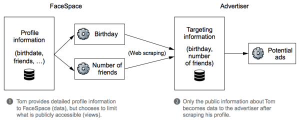

### **Chapter 2. Data model for Big Data**

The last chapter discusses basics of the Lambda Architecture, which provides a practical way to implement an arbitrary function on arbitrary data in real time.

[p28]

The master dataset is at the core of the Lambda Architecture, as shown in the figure below.

In the figure, the texts are:

1. The master dataset is the source of truth in your system and cannot withstand corruption.
2. The data in the speed layer realtime views has a high turnover rate, so any errors are quickly expelled.
3. Any errors introduced into the serving layer batch views are overwritten because they are continually rebuilt from the master dataset.

The master dataset in the Lambda Architecture serves as the source of truth for your Big Data system. <u>Errors at the serving and speed layers can be corrected, but corruption of the master dataset is irreparable.</u> If you lose all your serving layer datasets and speed layer datasets, you could reconstruct your application from the master dataset. This is because the batch views served by the serving layer are produced via functions on the master dataset, and since the speed layer is based only on recent data, it can construct itself within a few hours.

The master dataset must be safeguarded from corruption, which may be caused by errors due to:

* Overloaded machines
* Failing disks
* Power outages all could cause errors
* Human error with dynamic data systems, which is an intrinsic risk and inevitable eventuality.

The master dataset must be carefully engineered to prevent corruption in all these cases, as fault tolerance is essential to the health of a long-running data system.

There are two components to the master dataset:

* The data model you use.
* How you physically store the master dataset.

This chapter is about designing a data model for the master dataset and the properties such a data model should have. Physically storing a master dataset is the topic of the next chapter.

### The properties of data

Suppose you’re designing the next big social network: FaceSpace.  When a new user, Tom, joins your site, he starts to invite his friends and family. What information should you store regarding Tom’s connections?  You have a number of choices, including the following:

* The sequence of Tom’s friend and unfriend events
* Tom’s current list of friends
* Tom’s current number of friends

The following figure exhibits these options and their relationships.

This example illustrates information dependency. Each layer of information can be derived from the previous one (the one to its left), but it’s a one-way process. [p29]

The notion of dependency shapes the definitions of the terms:

* **Information** is the general collection of knowledge relevant to your Big Data system. It’s synonymous with the colloquial usage of the word *data*.
* **Data** refers to the information that can’t be derived from anything else. Data serves as the axioms from which everything else derives.
* **Queries** are questions you ask of your data.
    * For example, you query your financial transaction history to determine your current bank account balance.
* **Views** are information that has been derived from your base data. They are built to assist with answering specific types of queries.

The following figure illustrates the FaceSpace information dependency in terms of data, views, and queries.

<u>One person’s data can be another’s view.</u> Suppose an advertising firm creates a crawler that scrapes demographic information from user profiles on FaceSpace. FaceSpace has complete access to all the information Tom provided. For example, his complete birthdate is March 13, 1984, but he only makes his birthday (March 13) available on his public profile. His birthday is a view from FaceSpace’s perspective because it’s derived from his birthdate, but it’s data to the advertiser because they have limited information about Tom. This relationship is shown in the figure below:

Having established a shared vocabulary, the key properties of data can be introduced:

* Rawness
* Immutability
* Perpetuity (or the "eternal trueness of data").

These three key concepts is foundational to understanding Big Data systems.

[p31]
