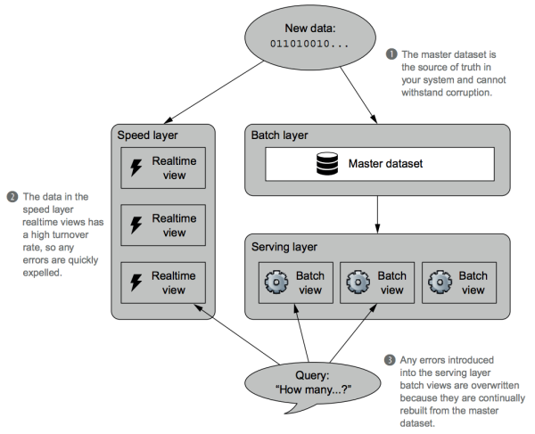
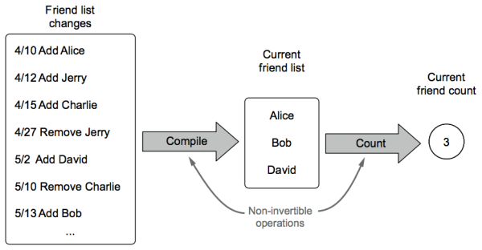
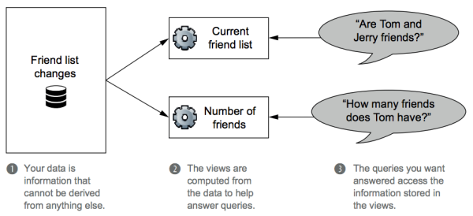
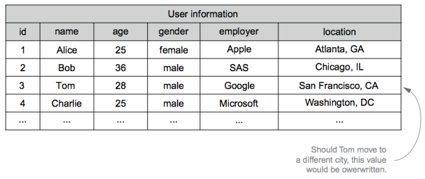

### **Chapter 2. Data model for Big Data**

The last chapter discusses basics of the Lambda Architecture, which provides a practical way to implement an arbitrary function on arbitrary data in real time.

[p28]

The master dataset is at the core of the Lambda Architecture, as shown in the figure below.

In the figure, the texts are:

1. The master dataset is the source of truth in your system and cannot withstand corruption.
2. The data in the speed layer realtime views has a high turnover rate, so any errors are quickly expelled.
3. Any errors introduced into the serving layer batch views are overwritten because they are continually rebuilt from the master dataset.

The master dataset in the Lambda Architecture serves as the source of truth for your Big Data system. <u>Errors at the serving and speed layers can be corrected, but corruption of the master dataset is irreparable.</u> If you lose all your serving layer datasets and speed layer datasets, you could reconstruct your application from the master dataset. This is because the batch views served by the serving layer are produced via functions on the master dataset, and since the speed layer is based only on recent data, it can construct itself within a few hours.

The master dataset must be safeguarded from corruption, which may be caused by errors due to:

* Overloaded machines
* Failing disks
* Power outages all could cause errors
* Human error with dynamic data systems, which is an intrinsic risk and inevitable eventuality.

The master dataset must be carefully engineered to prevent corruption in all these cases, as fault tolerance is essential to the health of a long-running data system.

There are two components to the master dataset:

* The data model you use.
* How you physically store the master dataset.

This chapter is about designing a data model for the master dataset and the properties such a data model should have. Physically storing a master dataset is the topic of the next chapter.

### The properties of data

Suppose you’re designing the next big social network: FaceSpace.  When a new user, Tom, joins your site, he starts to invite his friends and family. What information should you store regarding Tom’s connections?  You have a number of choices, including the following:

* The sequence of Tom’s friend and unfriend events
* Tom’s current list of friends
* Tom’s current number of friends

The following figure exhibits these options and their relationships.

This example illustrates information dependency. Each layer of information can be derived from the previous one (the one to its left), but it’s a one-way process. [p29]

The notion of dependency shapes the definitions of the terms:

* **Information** is the general collection of knowledge relevant to your Big Data system. It’s synonymous with the colloquial usage of the word *data*.
* **Data** refers to the information that can’t be derived from anything else. Data serves as the axioms from which everything else derives.
* **Queries** are questions you ask of your data.
    * For example, you query your financial transaction history to determine your current bank account balance.
* **Views** are information that has been derived from your base data. They are built to assist with answering specific types of queries.

The following figure illustrates the FaceSpace information dependency in terms of data, views, and queries.

<u>One person’s data can be another’s view.</u> Suppose an advertising firm creates a crawler that scrapes demographic information from user profiles on FaceSpace. FaceSpace has complete access to all the information Tom provided. For example, his complete birthdate is March 13, 1984, but he only makes his birthday (March 13) available on his public profile. His birthday is a view from FaceSpace’s perspective because it’s derived from his birthdate, but it’s data to the advertiser because they have limited information about Tom. This relationship is shown in the figure below:

Having established a shared vocabulary, the key properties of data can be introduced:

* Rawness
* Immutability
* Perpetuity (or the "eternal trueness of data").

These three key concepts is foundational to understanding Big Data systems.

[p31]

#### Data is raw

A data system answers questions about information acquired in the past. You want to be able to answer as many questions as possible. You always want to store the rawest data you can get your hands on. The rawer your data, the more information you can deduce from it, and the more questions you can ask of it. In the previous FaceSpace example, FaceSpace data is more valuable than the advertiser’s.

Stock market trading has millions of shares and billions of dollars changing a daily basis. Historically, stock prices are recorded daily as an opening price, high price, low price, and closing price. However, those bits of data often don’t provide the big picture and can potentially skew your perception of what happened.

In the following figure, for example, it records the price data for Google, Apple, and Amazon stocks on a day when Google announced new products targeted at their competitors.

This data suggests that:

* Amazon may not have been affected by Google’s announcement, as its stock price moved only slightly.
* The announcement had either no effect on Apple, or a positive effect.

At a finer time granularity, you can get a clearer picture of the events and probe into potential cause and effect relationships. The following figure depicts the minute-by-minute relative changes in the stock prices, which suggests that both Amazon and Apple were indeed affected by the announcement, Amazon more so than Apple.

. Short-term analysis isn’t supported by daily records but can be performed by storing data at finer time resolutions.")

[p32]

Storing raw data is highly valuable because you cannot know all the questions you want answered in advance. The rawest data enables you maximize your ability to obtain new insights, whereas summarizing, overwriting, or deleting information limits what your data can tell you. The trade-off is that rawer data typically entails more data. However, Big Data technologies are designed to manage petabytes and exabytes of data. Specifically, they manage the storage of your data in a distributed, scalable manner while supporting the ability to directly query the data.

The following texts discuss what information you should store as your raw data.

##### **Unstructured data is rawer than normalized data**

When deciding what raw data to store, a common hazy area is the line between *parsing* and *semantic normalization*. Semantic normalization is the process of reshaping free-form information into a structured form of data.

For example, FaceSpace may request Tom’s location. He may input anything for that field, such as San Francisco, CA, SF, North Beach, etc. A semantic normalization algorithm would try to match the input with a known place, as show in the figure below:

It’s better to store the unstructured string, because your semantic normalization algorithm may improve over time. If you store the unstructured string, you can renormalize that data at a later time when you have improved your algorithms. In the preceding example, you may later adapt the algorithm to recognize North Beach as a neighborhood in San Francisco, or you may want to use the neighborhood information for another purpose.

As a rule of thumb:

* If your algorithm for extracting the data is simple and accurate, like extracting an age from an HTML page, you should store the results of that algorithm.
* If the algorithm is subject to change, due to improvements or broadening the requirements, store the unstructured form of the data.

##### **More information doesn’t necessarily mean rawer data**

Assume Tom is a blogger, and he wants to add his posts to his FaceSpace profile. What exactly should you store once Tom provides the URL of his blog?

Storing the pure text of the blog entries is certainly a possibility. But any phrases in italics, boldface, or large font were deliberately emphasized by Tom and could prove useful in text analysis. For example, you could use this additional information for an index to make FaceSpace searchable. We’d thus argue that the annotated text entries are a rawer form of data than ASCII text strings.

At the other end of the spectrum, you could also store the full HTML of Tom’s blog as your data. While it’s considerably more information in terms of total bytes, the color scheme, stylesheets, and JavaScript code of the site can’t be used to derive any additional information about Tom. They serve only as the container for the contents of the site and shouldn’t be part of your raw data.

#### Data is immutable

In relational database, update is one of the fundamental operations. However, for immutability in Big Data, you don’t update or delete data, you only add more.

##### **Advantages of using immutable schema for Big Data systems** *

* **Human-fault tolerance**. This is the most important advantage of the immutable model.
    * [As discussed in Chapter 1](ch1.md#robustness-and-fault-tolerance), human-fault tolerance is an essential property of data systems. You must limit the impact of human mistakes and have mechanisms for recovering from them.
        * With a mutable data model, a mistake can cause data to be lost, because values are actually overridden in the database.
        * With an immutable data model, no data can be lost. If bad data is written, earlier (good) data units still exist. Fixing the data system is just a matter of deleting the bad data units and recomputing the views built from the master dataset.
* **Simplicity**.
    * Mutable data models imply that the data must be indexed in some way so that specific data objects can be retrieved and updated.
    * In contrast, <u>with an immutable data model you only need the ability to append new data units to the master dataset, which does not require an index for your data, which is a huge simplification.</u> As discussed in the next chapter, storing a master dataset is as simple as using flat files.

##### **Comparison between immutable and mutable schema** *

The advantages of keeping your data immutable become evident when comparing with a mutable schema.

The following figure shows a mutable schema for FaceSpace user information. If Tom moves to Los Angeles, previous values are overwritten and lost.

With an immutable schema, rather than storing a current snapshot, you create a separate record every time a user’s information evolves. Accomplishing this requires two changes:

1. Track each field of user information in a separate table.
2. Tie each unit of data to a moment in time when the information is known to be true.

The following figure shows a corresponding immutable schema for storing FaceSpace information.

")

Instead of updating preexisting records, an immutable schema uses new records to represent changed information. An immutable schema thus can store multiple records for the same user.

In the above figure, there are two location records for Tom (user ID #3), and because the data units are tied to particular times, they can both be true. <u>Tom’s current location involves a simple query on the data: look at all the locations, and pick the one with the most recent timestamp.</u> By keeping each field in a separate table, you only record the information that changed. This requires less space for storage and guarantees that each record is new information and is not simply carried over from the last record.

A trade-off of the immutable approach is that it uses more storage than a mutable schema:

1. The user ID is specified for every property, rather than once per row in a mutable approach.
2. The entire history of events is stored rather than the current view of the world.

You should take advantage of Big Data's ability to store large amounts of data using Big Data technologies to get the benefits of immutability. Hving a simple and strongly human-fault tolerant master dataset is important.

#### Data is eternally true

###  The fact-based model for representing data
