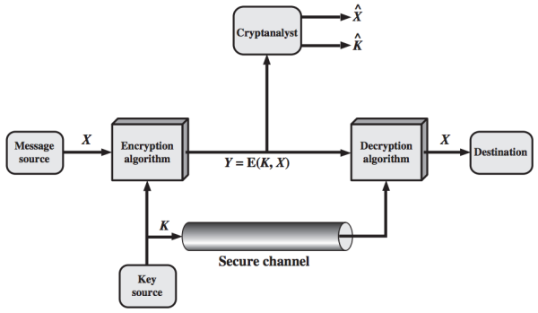

#### **Part 1: Symmetric Ciphers**

### **Chapter 2. Classical Encryption Techniques**

#### Definitions of Terms *

* **Plaintext**: original message
* **Ciphertext**: coded message
* **Enciphering** or **encryption**: the process of converting from plaintext to ciphertext
* **Deciphering** or **decryption:** the process of restoring the plaintext from the ciphertext

The many schemes used for encryption constitute the area of study known as [**cryptography**](https://en.wikipedia.org/wiki/Cryptography). Such a scheme is known as a [**cryptographic system**](https://en.wikipedia.org/wiki/Cryptosystem) (cryptosystem) or a [**cipher**](https://en.wikipedia.org/wiki/Cipher). Techniques used for deciphering a message without any knowledge of the enciphering details fall into the area of [**cryptanalysis**](https://en.wikipedia.org/wiki/Cryptanalysis). Cryptanalysis is what the layperson calls "breaking the code". The areas of cryptography and cryptanalysis together are called **cryptology**.

### Symmetric Cipher Model

A symmetric encryption scheme has five ingredients (as shown in the following figure):

* **Plaintext**: This is the original <u>intelligible</u> message or data that is fed into the algorithm as input.
* **Encryption algorithm**: The encryption algorithm performs various substitutions and transformations on the plaintext.
* **Secret key**: The secret key is also input to the encryption algorithm. The key is a value independent of the plaintext and of the algorithm. The algorithm will produce a different output depending on the specific key being used at the time. <u>The exact substitutions and transformations performed by the algorithm depend on the key.</u>
* **Ciphertext**: This is the scrambled (unintelligible) message produced as output.
    * It depends on the plaintext and the secret key. For a given message, two different keys will produce two different ciphertexts.
* **Decryption algorithm**: This is essentially the encryption algorithm run in reverse. It takes the ciphertext and the secret key and produces the original plaintext.

#### Encryption Requirements *

There are two requirements for secure use of conventional encryption:

1. The encryption algorithm must be strong.
    * At a minimum, an opponent who knows the algorithm and has access to one or more ciphertexts would be unable to decipher the ciphertext or figure out the key.
    * In a stronger form, the opponent should be unable to decrypt ciphertexts or discover the key <u>even if he or she has a number of ciphertexts together with the plaintext for each ciphertext.</u>
2. Sender and receiver must have obtained copies of the secret key in a secure fashion and must keep the key secure. If someone can discover the key and knows the algorithm, all communication using this key is readable.

#### Why not keep the encryption algorithm secret? *

We assume that it is impractical to decrypt a message on the basis of the ciphertext plus knowledge of the encryption/decryption algorithm. This means we do not need to keep the algorithm secret; we need to keep only the key secret. This feature of symmetric encryption makes low-cost chip implementations of data encryption algorithms widely available and incorporated into a number of products. With the use of symmetric encryption, the principal security problem is maintaining the secrecy of the key.

#### Model of Symmetric Cryptosystem *

The essential elements of a symmetric encryption scheme is described in the following figure:

* A source produces a message in plaintext, \(X = [X_1, X_2, ..., X_M]\).
* A key of the form \(K = [K_1, K_2, ..., K_J]\) is generated.
    * If the key is generated at the message source, then it must also be provided to the destination by means of some secure channel.
    * Alternatively, a third party could generate the key and securely deliver it to both source and destination.
* The ciphertext \(Y = [Y_1, Y_2, ..., Y_N]\) is produced by the encryption algorithm with the message *X* and the encryption key *K* as input.

The encryption process is:

$$ Y = E(K, X) $$

This notation indicates that *Y* is produced by using encryption algorithm E as a function of the plaintext *X*, with the specific function determined by the value of the key *K*.

The intended receiver with the key is able to invert the transformation:

$$ X = D(K, Y) $$

An opponent, observing *Y* but not having access to *K* or *X*, may attempt to recover *X* or *K* or both. It is assumed that the opponent knows the encryption (E) and decryption (D) algorithms. The opponent may do one of the following:

* Recover *X* by generating a plaintext estimate \(\hat{X}\), if the opponent is interested in only this particular message.
* Recover *K* by generating an estimate \(\hat{K}\), if the opponent is interested in being able to read future messages.

