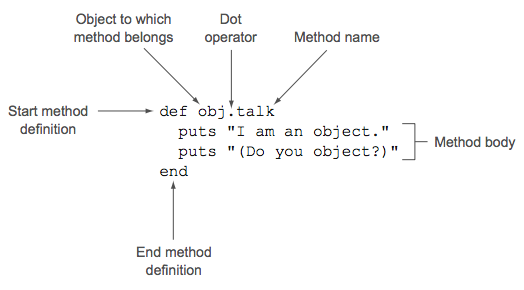

### **Chapter 2. Objects, methods, and local variables**

Every line of Ruby code involves the concept of the object. What you do with objects, broadly speaking, is send them messages, most of which correspond to names of methods that you’re asking the object to execute. This chapter details the combined processes of message sending and method calling.

### Talking to objects

In any Ruby program, the bulk of the design, logic, and action revolves around objects. When you write Ruby programs, your main activities are creating objects, endowing them with abilities, and asking them to perform actions. When you want something done, you ask an object to do it. For example, rather than ask in the abstract whether *a* equals *b*, you ask a whether it considers itself equal to *b*. Generally, writing a Ruby program is largely a matter of engineering your objects so that each object plays a clear role and can perform actions related to that role.

#### Ruby and object orientation

Ruby comes to the idea of manipulating data through objects via the program language design principle [object orientation](https://en.wikipedia.org/wiki/Object-oriented_programming). In object-oriented programming (OOP), you perform calculations, data manipulation, and input/output operations by creating objects and asking them to perform actions and provide you with information.

Designing object-oriented software is largely a matter of figuring out what you want your objects to be:

* What they should do,
* How they’ll interact with each other,
* How many of each there should be (for example, many students, one registrar),
* Other such questions.

Ruby provides a complete set of tools for:

* Naming, creating, addressing, and manipulating objects,
* The data they operate on through the manipulation of those objects.

#### Creating a generic object

[p36]

The following code creates a generic object, which does not represent or model anything specific:

```ruby
obj = Object.new
```

Now you have an object and a variable through which you can address it.

All Ruby objects are created with certain methods that they know how to execute because they’re Ruby objects.


##### **Defining an object’s behavior**

Specifically, and more technically, you have to define a method for your object. You do this using a special term, the keyword `def`. The following code defines method `talk` for the object `obj`:

```ruby
def obj.talk
  puts "I am an object."
  puts "(Do you object?)"
end
```

The following figure shows analysis of the above code:

[](figure_2.1.png "Figure 2.1 Anatomy of a method definition")

##### **Sending messages to objects**

Use the message-sending or method-calling syntax:

```ruby
obj.talk
```

The output is:

```text
I am an object.
(Do you object?)
```

The object `obj` *responds to* the message `talk`. <u>An object is said to respond to a message if the object has a method defined whose name corresponds to the message.</u>

A few things to consider about the dot-based message-sending syntax:

* The dot (`.`) is the message-sending operator. The message on the right is sent to the object (or *receiver*) on the left.
* The receiver can be often represented by a variable that stands in for an object; it can also be a literal object construct, e.g. a string in quotation marks.
* In practice, the message being sent is almost always the name of a method. The object always tries to act on the assumption that the message is the name of a method. If there’s no method by that name, error-handling measures are taken.

#### Methods that take arguments

In a method definition, you indicate the arguments by means of a list of variables in parentheses after the method name. Arguments can be required or optional. More precisely:

* The variables listed in the method definition are the method’s **formal parameters**.
* The values you supply to the method when you call it are the corresponding **arguments**.

However, it’s common to use the word *arguments*, informally, to refer to a method’s parameters as well as a method call’s arguments.

For example, define a method:

```ruby
def obj.c2f(c)
  c * 9.0 / 5 + 32
end
```

The method `obj.c2f` has one formal parameter, which means it takes one argument. When you call the method, you provide an argument:

```ruby
puts obj.c2f(100)
```

The result is:

```text
212.0
```

The parentheses are optional in both cases, you can also do this:

```ruby
def obj.c2f c
```
and this:

```ruby
obj.c2f 100
```

However, parentheses are not always optional, particularly when you’re stringing multiple
method calls together, so it’s good to lean toward using them rather than leaving them
out. You can make an exception for common or conventional cases where parentheses
are usually excluded, like calls to `puts`. But when in doubt, use the parentheses.

At the other end of the process, every method call *returns* a value.
